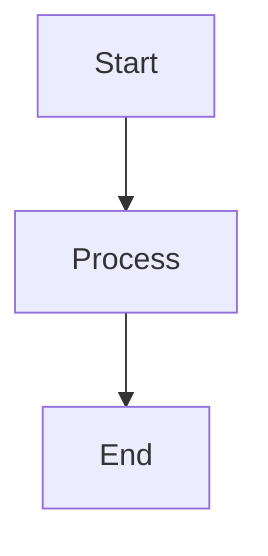

# Marginal

A modern desktop markdown editor built with Tauri, React 19, and Lexical. Inspired by MarkText's UI, built with modern technologies.

## Tech Stack

- **Desktop**: Tauri 2.9 (Rust-based, lightweight alternative to Electron)
- **Frontend**: React 19.2 + TypeScript
- **Build Tool**: Vite 6
- **Testing**: Jest + React Testing Library
- **Markdown Editor**: Lexical (Meta's modern rich text framework)
- **Mermaid**: mermaid.js for diagram rendering
- **Styling**: CSS Modules + modern CSS
- **State Management**: Zustand
- **File System**: Tauri's fs API

## Project Structure

```
marginal/
├── src-tauri/          # Rust backend
│   ├── src/
│   │   ├── main.rs
│   │   ├── commands/
│   │   │   ├── file_ops.rs  # File operations
│   │   │   └── dialog.rs    # File dialogs
│   │   └── menu.rs          # App menu & shortcuts
│   ├── Cargo.toml
│   └── tauri.conf.json
├── src/                # React frontend
│   ├── components/
│   │   ├── Sidebar/
│   │   │   ├── FileTree/
│   │   │   ├── Search/
│   │   │   └── TableOfContents/
│   │   ├── Editor/
│   │   │   ├── EditorTabs/
│   │   │   ├── MarkdownEditor/  # Lexical-based
│   │   │   └── MermaidBlock/     # Mermaid rendering
│   │   └── Layout/
│   ├── hooks/
│   │   ├── useFileSystem.ts
│   │   └── useKeyboardShortcuts.ts
│   ├── stores/
│   │   ├── editorStore.ts       # Zustand store
│   │   └── fileStore.ts         # Zustand store
│   ├── utils/
│   │   ├── frontmatter.ts       # Parse YAML frontmatter
│   │   └── markdown.ts
│   ├── App.tsx
│   └── main.tsx
├── tests/
│   ├── unit/
│   └── integration/
├── public/
├── package.json
├── vite.config.ts
├── tsconfig.json
└── jest.config.js
```

## Core Features

### 1. Sidebar (collapsible, resizable)
- Icon bar (files, search, TOC)
- File tree with folder navigation
- Basic search across files
- Table of contents from headers

### 2. Editor
- Tab management (open, close, switch)
- WYSIWYG markdown editing with Lexical
- Live preview rendering
- Syntax highlighting for code blocks
- **Mermaid diagram rendering** in preview
- **Frontmatter support** (YAML at top of file)

### 3. File Operations
- Open file/folder (native dialogs)
- Save file manually (Cmd/Ctrl+S)
- New file (Cmd/Ctrl+N)
- Recent files list
- Unsaved changes indicator

### 4. Keyboard Shortcuts
- `Cmd/Ctrl+N`: New file
- `Cmd/Ctrl+O`: Open file
- `Cmd/Ctrl+S`: Save
- `Cmd/Ctrl+W`: Close tab
- `Cmd/Ctrl+B`: Toggle sidebar
- `Cmd/Ctrl+Shift+F`: Search in files
- Standard markdown shortcuts (bold, italic, headers, lists, etc.)

## Key Dependencies

```json
{
  "dependencies": {
    "react": "^19.2.4",
    "react-dom": "^19.2.4",
    "@tauri-apps/api": "^2.9.1",
    "lexical": "^0.21.0",
    "@lexical/react": "^0.21.0",
    "@lexical/markdown": "^0.21.0",
    "zustand": "^5.0.2",
    "mermaid": "^11.4.1",
    "gray-matter": "^4.0.3"
  },
  "devDependencies": {
    "@tauri-apps/cli": "^2.9.1",
    "vite": "^6.0.0",
    "@vitejs/plugin-react": "^4.3.4",
    "typescript": "^5.7.0",
    "jest": "^29.7.0",
    "@testing-library/react": "^16.1.0"
  }
}
```

## Development Phases

### Phase 1: Project setup
- Initialize Tauri + Vite + React 19 + TypeScript
- Configure Jest
- Basic app window and layout structure
- Zustand store setup

### Phase 2: File system & sidebar
- File tree component
- Tauri file operations (open, save)
- Recent files tracking
- Sidebar navigation

### Phase 3: Lexical editor integration
- Markdown editing with Lexical
- Tab management
- Frontmatter parsing/editing
- Save functionality with unsaved indicator

### Phase 4: Markdown features
- Syntax highlighting
- Table of contents generation
- Mermaid diagram rendering
- Search functionality

### Phase 5: Keyboard shortcuts & polish
- Global keyboard shortcuts via Tauri
- Error handling
- Loading states
- Basic settings persistence

## Frontmatter Handling

Files can include YAML frontmatter at the top:

```markdown
---
title: My Document
date: 2026-01-31
tags: [markdown, editor]
---

# Content starts here
```

- Parsed with `gray-matter`
- Preserved on save
- Not rendered in preview

## Mermaid Rendering

Mermaid diagrams are rendered in preview mode:

````markdown

````

- Detected from code blocks with `mermaid` language
- Rendered as diagrams in preview mode
- Shown as code in edit mode

## What's Excluded

- ❌ Theming/dark mode
- ❌ Internationalization
- ❌ Cloud sync
- ❌ Spell checker
- ❌ Export to PDF/HTML
- ❌ Image uploads to cloud services
- ❌ Math equations (KaTeX)
- ❌ Web compatibility

## Getting Started

See [AGENTS.md](./AGENTS.md) for development workflow and task tracking.

```bash
# Install dependencies
npm install

# Run development server
npm run tauri dev

# Build for production
npm run tauri build

# Run tests
npm test
```

## License

TBD
