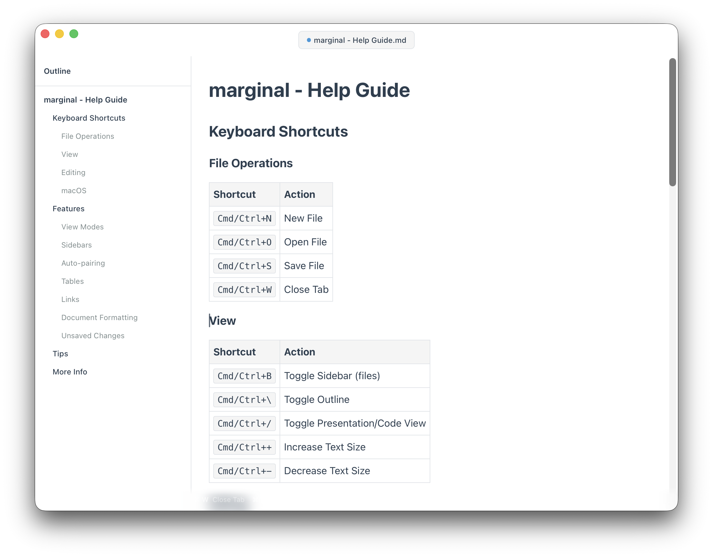

# marginal

A lightweight desktop markdown editor with multiple viewing modes, built with Tauri and React.



## Features

- **Multiple View Modes**: Edit, code, and presentation views for different workflows
- **Document Outline**: Automatic outline generation from markdown headings
- **Tab Management**: Work with multiple documents simultaneously
- **File Operations**: Open, save, and manage markdown files
- **Syntax Highlighting**: Code blocks with Prism.js support
- **Mermaid Diagrams**: Render diagrams directly in your documents
- **Frontmatter Support**: YAML metadata at the top of documents
- **Keyboard Shortcuts**: Full keyboard navigation and commands

## Quick Start

```bash
# Install dependencies
npm install

# Development
npm run tauri dev        # Desktop app with hot-reload
npm run dev              # Web-only mode

# Production
npm run tauri build      # Desktop app (outputs to src-tauri/target/release/bundle/)
npm run build            # Web build

# Testing
npm test                 # Run tests
npm run test:ui          # Vitest UI
```

## Tech Stack

Tauri 2 • React 19 • TypeScript • Lexical • Vite • Zustand

## Specs

Comprehensive list of implemented behaviors for agent reference. Check of each item as it's implemented and has solid tests.

- [x] File Operations
  - [x] Open files via dialog (markdown files only)
  - [x] Open folders and display file tree
  - [x] Save existing files
  - [x] Save As for untitled files with dialog
  - [x] Create new files with automatic Untitled numbering (Untitled.md, Untitled2.md, etc.)
  - [x] Track recent files (up to 10)
  - [x] Persist last opened folder across sessions
  - [x] Hidden files and folders (starting with `.`) are excluded from file tree
  - [x] Frontmatter in markdown files is parsed on open and preserved on save
  - [x] File tree displays folders first, then files, both sorted alphabetically
  - [ ] Print document via File menu
- [x] Editor Views
  - [x] Two view modes: rendered (presentation/WYSIWYG) and code (plain text)
  - [x] Toggle between views with Cmd/Ctrl+/ or view toggle buttons
  - [x] Rendered view uses Lexical rich text editor with live markdown rendering
  - [x] Code view shows raw markdown in plain text editor
  - [x] Content persists when switching between views
- [x] Tab Management
  - [x] Multiple tabs for working with multiple documents
  - [x] Switch between tabs by clicking tab headers
  - [x] Close tabs with close button or Cmd/Ctrl+W
  - [x] Dirty indicator (•) appears when tab has unsaved changes
  - [x] Unsaved tabs show "Unsaved" in document title
  - [x] When closing a tab, the previous tab becomes active
  - [ ] When no tabs exist, a blank Untitled file is created automatically
  - [x] For untitled files, tab name updates to first heading when user types one
- [x] Markdown Features
  - [x] Headings (H1-H6) render with proper styling
  - [x] Lists (ordered and unordered) with proper indentation
  - [x] Pressing Enter at end of empty list item exits the list
  - [ ] Links render as clickable in rendered view
  - [x] Inline code with backticks renders with monospace styling
  - [ ] Code blocks with language syntax highlighting (Prism.js)
  - [x] Block quotes render with left border styling
  - [x] Tables render with proper grid layout
  - [x] Mermaid code blocks render as diagrams in rendered view
  - [ ] Images support URLs, absolute file paths, and relative file paths
- [x] Table Editing
  - [x] Tables are editable in rendered view
  - [x] Users can edit content inline in table cells
  - [x] Inline formatting (code, bold, italic, etc.) works inside cells
  - [ ] Right-click on table cells opens context menu
  - [ ] Context menu actions
    - [ ] Insert row above
    - [ ] Insert row below
    - [ ] Insert column left
    - [ ] Insert column right
    - [ ] Delete row
    - [ ] Delete column
  - [ ] Tables can be resized by dragging column edges
  - [x] Insert table via Cmd/Ctrl+Shift+T shortcut
  - [x] Tables convert to/from markdown format when switching views
  - [x] Inline formatting persists when switching between views
- [x] Outline
  - [x] Outline auto-generates from markdown headings (H1-H6)
  - [x] Outline displays hierarchically with indentation based on heading level
  - [x] Clicking outline item scrolls to that heading in rendered view
  - [x] Outline shows "No headings found" when document has no headings
  - [x] Toggle outline visibility with Cmd/Ctrl+\
  - [x] Outline width is resizable and persists across sessions
  - [x] Outline view is open by default on app launch
- [x] Find in Document
  - [x] Open find dialog with Cmd/Ctrl+F
  - [x] Search is case-insensitive by default
  - [x] Toggle case-sensitive search with button
  - [x] Navigate through matches with previous/next buttons
  - [x] Match counter shows current match and total (e.g., "1 of 5")
  - [x] Shows "No matches" when search has no results
  - [x] Navigation buttons disabled when no matches
  - [x] Close find dialog with Escape or close button
  - [x] Match count updates as content changes
- [ ] Find and Replace
  - [ ] Open find and replace panel with Cmd/Ctrl+H
  - [ ] Replace current match with replacement text
  - [ ] Replace all matches at once
  - [ ] Find and replace respects case-sensitive toggle
- [x] Document Formatting
  - [x] Format document with Cmd/Ctrl+Shift+F (Prettier)
  - [x] Formatting only available in code view (error shown if in rendered view)
  - [x] Formatting marks document as dirty
  - [x] Formatting settings: preserve prose wrap, 120 character print width
- [x] Zoom
  - [x] Zoom in with Cmd/Ctrl++ or View menu
  - [x] Zoom out with Cmd/Ctrl+- or View menu
  - [x] Reset zoom to 100% with Cmd/Ctrl+0 or View menu (Actual Size)
  - [x] Code view and rendered view have independent zoom levels
  - [x] Zoom range: 50% to 200% in 25% increments
  - [x] Zoom levels persist across sessions (stored separately per view)
- [x] Settings Persistence
  - [x] Sidebar visibility persists across sessions
  - [x] Sidebar width persists across sessions
  - [x] Outline visibility persists across sessions
  - [x] Outline width persists across sessions
  - [x] Last opened folder path persists across sessions
  - [x] Recent files list persists across sessions (up to 10 files)
  - [x] Zoom levels persist across sessions using tauri-plugin-store
- [x] Keyboard Hints
  - [x] Shows keyboard shortcuts overlay when Cmd/Ctrl is held for 1 second
  - [x] Uses platform-appropriate labels (⌘ for Mac, Ctrl for Windows/Linux)
  - [x] Hides hints when Cmd/Ctrl is released
  - [x] Hides hints when window loses focus
  - [x] Displays shortcuts for: New File, Open File, Save, Close Tab, Find, Format, Toggle View, Toggle Outline, Zoom In, Zoom Out, Actual Size, Bold, Italic, and Headings
- [x] UI/UX
  - [ ] Loading overlay with message during long operations
  - [x] Toast notifications for success/error messages
  - [x] File tree with expandable/collapsible folders
  - [x] File tree shows emoji icons (📁 folder, 📂 open folder, 📝 markdown, 📄 other)
  - [x] Icon bar for switching between file tree and outline views
  - [x] Sidebar is resizable by dragging edge
  - [x] Document title in browser/window updates based on active tab name
  - [ ] Empty state messages when no files/folders opened
- [x] Platform Support
  - [x] Desktop app via Tauri (macOS, Windows, Linux)
  - [x] Web compatibility mode (with download instead of save)
  - [x] Native file dialogs on desktop
  - [x] File download functionality in web mode
